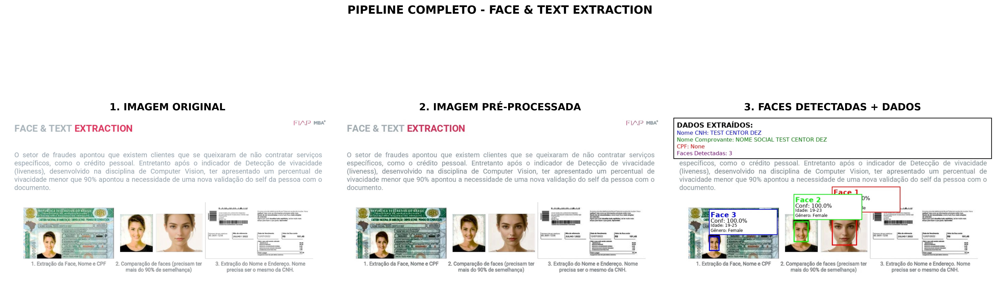
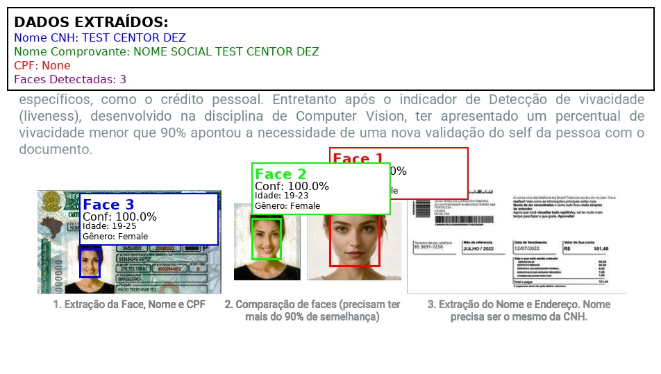

1. Colocado os pds e md do curso em avalição no LM [NotebookLM](https://notebooklm.google.com/notebook/cbcd8576-675e-4461-9040-dfd2c898d1bb)  [Resumo esperto aqui](Análise Abrangente de Ambientes Cognitivos e IA & LLMs)
   
2. Colocado o [Exercício para Entrega](reports/EXERCICIO%20 PARA%20ENTREGA) no NotebookLM, foi recebida uma [Proposição para Solução](reports/PROPOSIÇÃO%20PARA%20SOLUÇÃO) 
   
3. Essa [Proposição para Solução](reports/PROPOSIÇÃO%20PARA%20SOLUÇÃO.md) foi alimentada e trabalhada com o GPT 4.5 e Claude 4 Sonnet, obtendo-se o [Plano de Ataque - Detalhado](PLANO%20DE%20ATAQUE%20DETALHADO.md) .

4. ==Decidi pela criação de um container no worker da docker Swarm que estou rodando, para conter todas as dependências sem gerar conflito com os demais que estão rodando em outros jobs== 
   **==DEU RUIM! PERDI DOIS DIAS COM ISSO E NÃO FUNCIONOU==**

5. Criado o container stand-alone, rodando na rede configurada para os demais containers. [Definições desse container estão aqui.](README_container_plano_ataque.md)  Posteriormente, depois de muita confusão com os dockers, resolvi abandonar o nome que estava usando e passei a adotar o famoso container-verificacao. Sua criação segue as [Instruções para criação do container](Instruções%20para%20o%20container.md) .

6. Foram obtidas as senhas para a [AWS](README_aws_credenciais_corrigido.md)  (muito utilizada no projeto) e [OPENAI](OPEN%20AI%20-%20CHAVE.md) que não foi utilizada.
   
7. Foi criado um notebook que testou e validou o acesso a AWS e OPENAI [com essas características](00_configuração_aws_openai_s3.md) e com esse código 

8. Foi criado um notebook que trabalhou as imagens e texto na AWS, [com essas características e resultados](RELATÓRIO%20TÉCNICO%20-%20NOTEBOOK%201-%20%20PROCESSAMENTO%20E%20ANÁLISE%20DE%20IMAGENS.md) e com este código  

9. Foi criado um notebook voltado para atender a demanda do exercício proposto [com essas características e resultados](RELATÓRIO%20TÉCNICO%20-%20NOTEBOOK%202%20-%20VISUALIZAÇÃO%20E%20ANÁLISE%20AVANÇADA.md) e com este código  

10. Com a primeira rodada, percebi que o erro na extração do nome era causada pela expressão NOME SOCIAL na conta e então criei um método alternativo em que NOME  e NOME SOCIAL tem a mesma função e, assim, a palavra SOCIAL some do nome da pessoa.
    
11. Após esse ajuste, todos os critérios de qualidade colocados pelo exercício foram atingidos e dei por encerrado a tarefa. [Veja aqui a analise dos resultados](Resultados.md)

12. Fiquei curioso para verificar visualmente os estágios pré-tratamento e final da figura. Pedi que fosse feito um painel comparando isso.  
 
13. Também pedi que fosse mostrado os "quadradinhos" nas fotos. Vejam abaixo 14. Atendendo ao chamamento do professor, fiz o [fechamento dos serviços](FECHAMENTO%20DOS%20SERVIÇOS.md) na conta AWS, deletando os objetos em S3.

